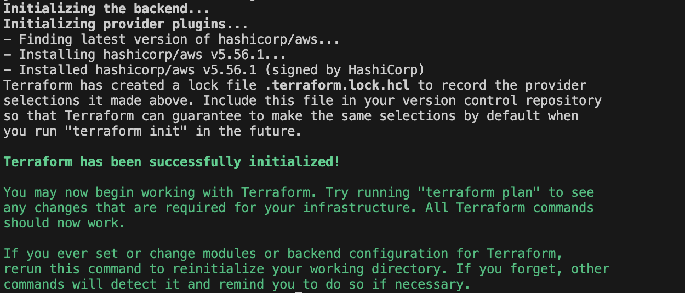
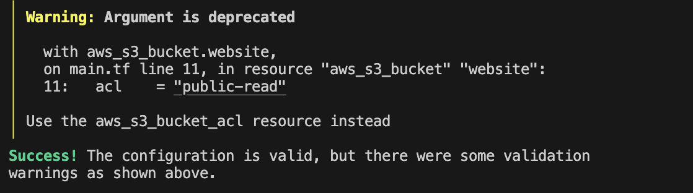
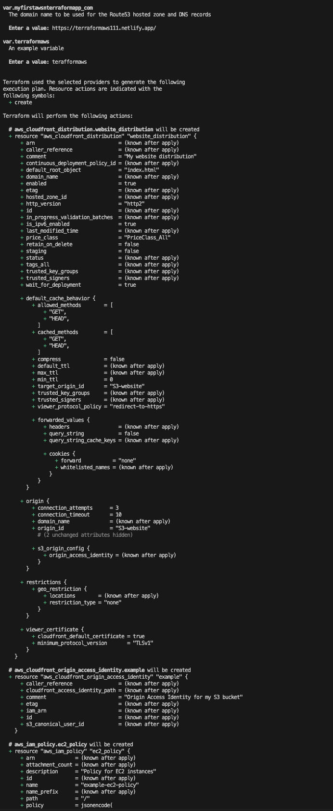

# Deploying Static Website to AWS S3 Bucket using Terraform 
In this project I will deploying a static project to AWS S3 Bucket using Terraform. 

## Setup and Configured AWS S3 Bucket
- Login into [AWS Console](https://eu-north-1.console.aws.amazon.com/s3/) 
- Create a **bucket** and name 
- Visit the **properties** and under the **static website hosting**, choose **Use this bucket to host a website** and enable static website hosting. Enter *index.html* and *error.html*. Once you save the changes you will get an **endpoint**. 
- Edit to disable block public access settings by choosing **permissions** and uncheck the block all public access then save the changes 
- Visit **permissions** and edit the bucket policy then edit this codebase to the **Bucket Policy Editor**
````
{
    "Version": "2012-10-17",
    "Statement": [
        {
            "Sid": "PublicReadGetObject",
            "Effect": "Allow",
            "Principal": "*",
            "Action": [
                "s3:GetObject"
            ],
            "Resource": [
                "arn:aws:s3:::terafformaws/*"
            ]
        }
    ]
}

````
- configure index.html and error.html files locally
- Open the bucket on the AWS console and upload the files 

### Endpoint
[deployed website url](http://terafformaws.s3-website.eu-north-1.amazonaws.com)

## Configuring the CloudFront Distribution
- Select Distributions and [Create a Distribution](https://us-east-1.console.aws.amazon.com/cloudfront/v4/home#/distributions)
- Select the bucket we had created above then Cloudfront will be linked to it
- 
 
### Distribution 
[Website Cloudfront Distribution](https://d26beg8fh03ybk.cloudfront.net)

## Route53 
- Visit the [Route53 dashboard](https://us-east-1.console.aws.amazon.com/route53/v2/home#Dashboard) 
- select register domain, enter the domain name then go and search the domain. 
- Alternatively can transfer existing domain to Route53
- the portal will show a range of domain names and the price range - one can pay and acquire it 

## Terraform 
Using the project setup locally:
Wrote the ``main.tf`` file using the variables linked with:

- the provider of AWS region, the AWS S3 details i.e ``index.html`` & ``error.html`` documents
- CloudFront Distribution configuration 

Wrote the Route53 file:
- configured the Route53 using the details from the new domain we had registered on AWS Route 53 console

Wrote Variables file:
- defines some variables used within the main.tf file among others 

Wrote the permissions file:
- defines the IAM roles 

Wrote env file:
- It has the *AWS_ACCESS_KEY_ID* and *AWS_SECRET_ACCESS_KEY* linked to my user IAM role  

Run the following Commands
``````
$ terraform init

``````



```$ terraform fmt```

permissions.tf


```$ terraform validate```



```$ terraform plan```



- I didn't pay for the Route53 domain so I used a [netlify](https://terraformaws111.netlify.app/) domain as my domain name for the Route53 hosted zone 

## Acknowledgement 

I acknowledge [AltSchool Africa](https://altschoolafrica.com/) and our instructor for the quality Cloud Engineering course and walkthrough AWS services, Terraform and more skills that has been useful over this project.